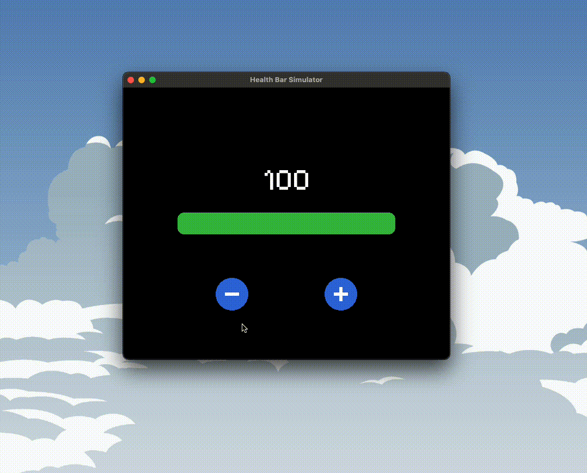

# Health Bar Simulator


An interactive **health bar** built in **C++** with **SFML 3**, structured around **MVVM** to keep game rules, presentation logic, and rendering in separate layers. Damage and healing are communicated entirely through motion — an interpolated highlight over the changed segment, threshold-driven colour, and a camera shake when a click can't be applied.

## Demo



## Technical Highlights

- **MVVM layering** — the model owns health and its clamping rules, the view model adapts them for display, and the view owns every SFML type. `main.cpp` is a composition root and nothing else
- **Custom `RoundedRectangle`** extending `sf::Shape`, approximating each corner with an arc and clamping its radius against the current size so a shrinking bar degrades to a pill instead of inverting
- **Interpolated change highlight** over the segment between old and new health — red on damage, blue on heal — with rapid clicks accumulating into one span rather than restarting
- **Decaying sine-wave camera shake** on rejected input, driven through a shifted `sf::View` that is restored before the next event poll so hit-testing stays accurate mid-shake
- **Delta-time-driven animation**, so every effect runs on wall-clock time rather than frame count
- **Threshold-based colour** — green above 55%, yellow from 20–55%, red at or below 20%

## Build

Requires a C++23 compiler and CMake 4.0+. SFML 3.1.0 is fetched automatically via `FetchContent`, so there is nothing to install by hand.

```bash
cmake -B build
cmake --build build
./build/healthBarSim
```
